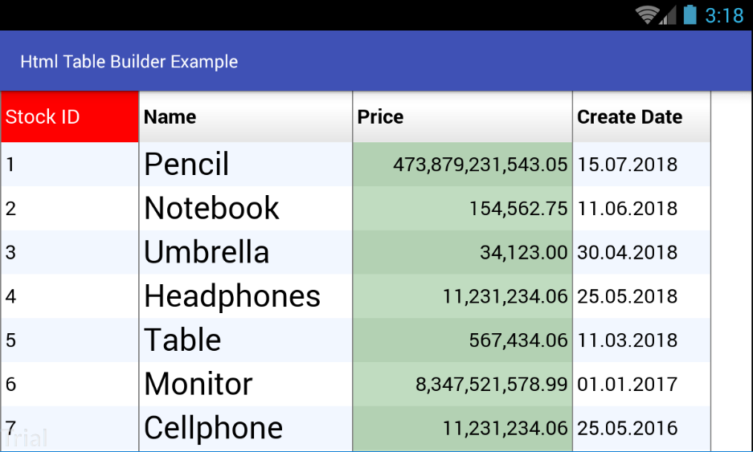

# Html Table Builder
Report Table for Android Projects

# Whos uses this library?
[TourVisio 2 Mobile](https://play.google.com/store/apps/details?id=com.santsg.tv2m)

[Paximum](https://play.google.com/store/apps/details?id=com.santsg.paximum)

[Sejour Mobile](https://play.google.com/store/apps/details?id=com.santsg.sejourmobile)


## Screen Shots



## Usage

### Step 1
```groovy
allprojects {
	repositories {
		...
		maven { url 'https://jitpack.io' }
	}
}
```

### Step 2

Add dependencies in build.gradle.
```groovy
dependencies {
   
}
```

### Step 3 (Create HtmlTableBuilder for Custom class)
```java
HtmlTableBuilder tableBuilder = new HtmlTableBuilder(getApplicationContext(), true);
tableBuilder.setNoDataText("No Data");
tableBuilder.setOutOfMemoryText("Due to excessive data, report can not be displayed. Please try again with more applicable search criteria.");
``` 

### Step 4 (Create table header info)
```java
LinkedHashMap<String, mdlHeaderCell> headerInfos = new LinkedHashMap<>();
headerInfos.put("id", new mdlHeaderCell.Builder()
			.value("Stok ID")
			.alignment(enmAlignment.LeftJustify)
			.valueType(enmCellValueType.Integer)
			.backgroundColor("red")
			.textColor("white")
			.width(110)
			.build());

headerInfos.put("name", new mdlHeaderCell.Builder()
		.value("Name")
		.alignment(enmAlignment.LeftJustify)
		.valueType(enmCellValueType.String)
		.fontSize(25)
		.width(170)
		.build());

headerInfos.put("price", new mdlHeaderCell.Builder()
		.value("Price")
		.alignment(enmAlignment.RightJustify)
		.displayFormat(FormatSettings.DecimalFormat)
		.valueType(enmCellValueType.Decimal)
		.width(175)
		.build());

headerInfos.put("crtDate", new mdlHeaderCell.Builder()
		.value("Create Date")
		.alignment(enmAlignment.LeftJustify)
		.displayFormat(FormatSettings.ShortDateFormat)
		.valueType(enmCellValueType.DateTime)
		.width(110)
		.build());
		
tableBuilder.setHeaderInfos(headerInfos);
```

### Step 5 (Create table footer info)
```java
LinkedHashMap<String, mdlFooterCell> footerInfos = new LinkedHashMap<>();

footerInfos.put("id", new mdlFooterCell.Builder()
		.type(enmFooter.Count)
		.build());

footerInfos.put("price", new mdlFooterCell.Builder()
		.type(enmFooter.Sum)
		.build());

tableBuilder.setFooterInfos(footerInfos);
```

## Step 6 (Prepare list row)
```java
List<Stock> result = new ArrayList<>();
Stock stock = new Stock();
stock.setId(1);
stock.setName("Pencil");
stock.setPrice(getRandomDouble());
stock.setCrtDate("2018-07-15T22:55:00");
result.add(stock);

stock = new Stock();
stock.setId(2);
stock.setName("Notebook");
stock.setPrice(new Double(154562.75));
stock.setCrtDate("2018-06-11T12:32:00");
result.add(stock);

stock = new Stock();
stock.setId(3);
stock.setName("Umbrella");
stock.setPrice(getRandomDouble());
stock.setCrtDate("2018-04-30T08:07:00");
result.add(stock);

tableBuilder.setDataSet(result);
```

## Step 7 (Cell, Header customization)
```java
tableBuilder.setListener(new HtmlTableBuilderListener() {
	@Override
	public void onDrawCell(int dataIndex, mdlGridCell cell) {
		boolean isMoneyCol = cell.getValueType() == enmCellValueType.Decimal;

		if ((dataIndex % 2) == 0){
			cell.setBackgroundColor(!isMoneyCol ? "#F2F7FF" : "#B3D1B3");
		}else if (!isMoneyCol)
			cell.setBackgroundColor("white");
		else
			cell.setBackgroundColor("#C0DCC0");
	}

	@Override
	public void onDrawColumnHeader(int dataIndex, mdlGridCell cell) {

	}

	@Override
	public void onCalcFields(int rowIndex, LinkedHashMap<String, mdlGridCell> rowData) {

	}
});
```

## Step 8 (Table to WebView)
```java
String htmlPath = tableBuilder.build("table.html");

webView.getSettings().setBuiltInZoomControls(true);
webView.getSettings().setDisplayZoomControls(false);
webView.getSettings().setJavaScriptEnabled(true);
webView.getSettings().setJavaScriptCanOpenWindowsAutomatically(true);

webView.loadUrl("file:///" + htmlPath);
```

## Contact me
 If you have a better idea or way on this project, please let me know, thanks :)

[Email](mailto:b.atalay07@hotmail.com)

[My Blog](http://brsatalay.blogspot.com.tr)

[My Linkedin](http://linkedin.com/in/barisatalay07/)
